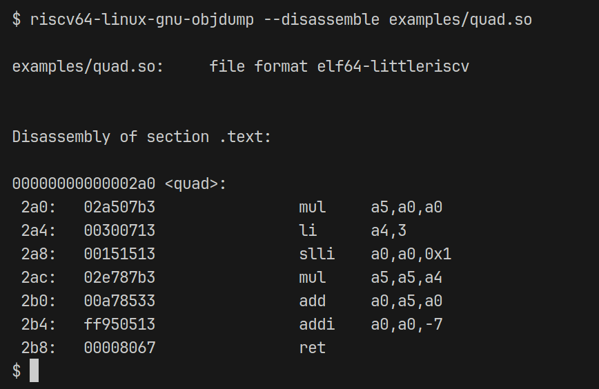
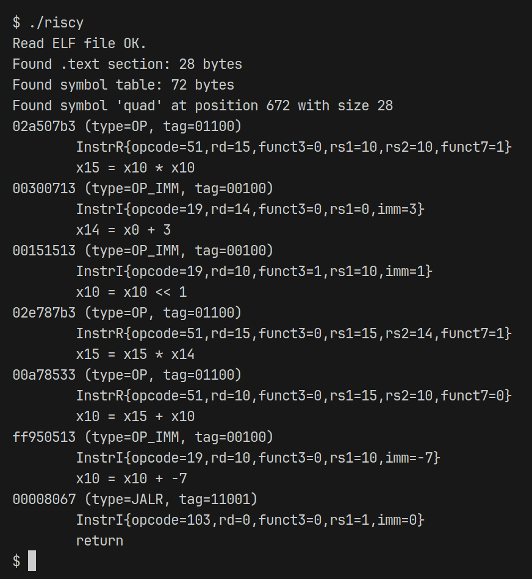

# riscy

An ELF loader, RISC-V decoder/disassembler, and C code-generator... In other words, a very basic decompiler.

ELF parsing/loading is in [elf.h](./elf.h)/[elf.cpp](./elf.cpp); RISC-V disassembler and codegen (WIP) are in [risc.h](./risc.h); buffer helper is in [buffer.h](./buffer.h)/[buffer.cpp](./buffer.cpp).

## Testing / Output

> [!NOTE]
> You will need the `riscv64-linux-gnu-gcc` toolchain installed to run the `examples` target. On Ubuntu, you can get this by installing `gcc-riscv64-linux-gnu`.

```
make examples
make -B riscy
./riscy
```

_Disassembly from `objdump`:_


_Output of `./riscy`:_


## Goals

The end-goal of the project is to recompile (using C/C++ as an intermediate) a simple binary/shared object targeted at RISC-V to another architecture. Currently, pseudo-code generation is already working.

The next step will involve creating a runtime state machine that will simulate RISC-V register and memory state. This will allow the use of C/C++ as an intermediate representation and avoids having to perform target-specific code generation (i.e. register mapping).

After this is completed, the codegen can be targeted at the state machine data structures, and then sent to a C/C++ compiler for final compilation.

Currently only part of the RV32I and RV32M instruction sets are implemented, but generic decoding support is already there for all instructions.

## License

MIT License. See [LICENSE](./LICENSE).
